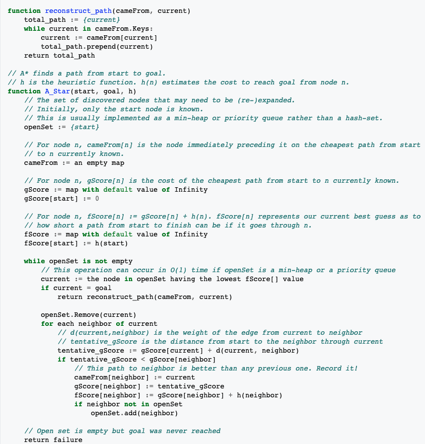
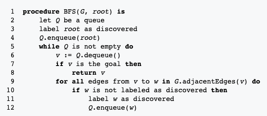
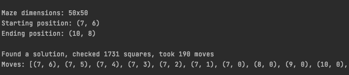

# Pathfinder
This is a simple 2D maze pathfinder + visualiser

# Requirements
- pygame~=2.0.0

# A* algorithm

# Breadth First algorithm

# Using the pathfinder
- Run the ./main.py file

- Choose the algorithm you would like to use and whether to visualise it or not
  
- A maze-creator window will pop up where you can create/load your maze  

- Press ENTER to find the path  

- If a path is found you can see more details in the console  

